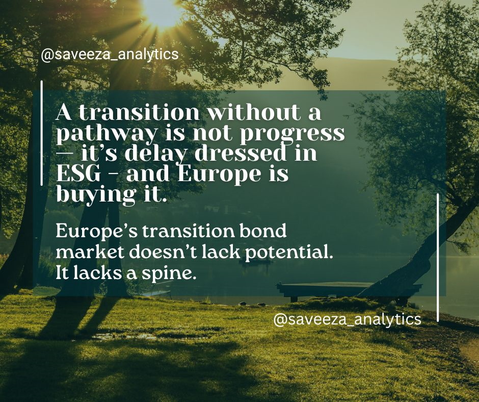

[](https://mybinder.org/v2/gh/Saveeza/eu-transition-bonds-credibility-policy-analysis/HEAD)
[](https://doi.org/10.5281/zenodo.16150064)

---

[](https://github.com/Saveeza/eu-transition-bonds-credibility-policy-analysis)


---


# 📊 Transition Bonds Europe: Gap, Risk, Data & Policy Analysis

> **A professional research & data analytics project exploring credibility gaps, policy risk, and country-level exposure in European transition bonds.**  
> Combines data science, financial analysis, and ESG policy review to assess whether transition bonds drive real impact — or just greenwashing.

---


## 🧠 Key Technical Skills Demonstrated

- 📊 Advanced financial data analysis (issuance patterns, sector exposure)  
- 🧮 ESG & credit risk correlation modeling  
- 🗺 Gap & risk matrix building using real-world regulatory frameworks  
- 📈 Data visualization with Python (heatmaps, radar plots, bar charts)  
- 🏛 Deep dive into EU sustainable finance regulations (GBS, Taxonomy)  
- 🧰 Tools: pandas, seaborn, scikit-learn, plotly, Excel

---

## 📘 What’s Inside the Notebook

- 📥 **Loads** `transition_issuance.csv` and `policy_gap_matrix.csv`  
- 📊 **Correlation matrix** between ESG score, credit spreads & issuance volume  
- 🧠 **Country-level policy credibility review** (Germany, France, Italy)  
- 🕸 **Radar chart visualization** of EU policy gaps  
- ✅ **Conclusions & recommendations** for improving bond credibility

---

## 🖼️ Visuals

ESG vs Credit Spread Correlation  ![Correlation Matrix]

Policy Gaps Radar Chart  ![Policy Gap Radar]

---

## 📂 Project Structure

```plaintext
📁 data/
    ├── transition_issuance.csv
    └── policy_gap_matrix.csv

📁 notebooks/
    └── transition_bond_analysis.ipynb

📁 visuals/
    ├── correlation_matrix.png
    └── policy_gaps_radar.png

📁 references/
    └── (to be added)
```
---

## 📄 Article

    📄 [Transition Bonds Are the New Greenwashing – How Europe’s Bond Market is Losing Credibility (PDF)](article/Transition%20Bonds%20Are%20the%20New%20Greenwashing,%20How%20Europe%E2%80%99s%20Bond%20Market%20is%20Losing%20Credibility.pdf)

  📄 [Read the full article (PDF)](article/Transition%20Bonds%20Are%20the%20New%20Greenwashing,%20How%20Europe%E2%80%99s%20Bond%20Market%20is%20Losing%20Credibility.pdf)


---

## 🔗 **Part of my ESG & transition bonds research series**

- 🌍 [From Greenwashing to Real Impact — Why Transition Bonds Matter](https://github.com/Saveeza/transition-bonds-impact-analysis)
- 🇪🇺 [Transition Bonds: The New Greenwashing?](https://www.linkedin.com/pulse/transition-bonds-new-greenwashing-how-europes-bond-market-chaudhry--sqdvf)

---

## 🙌 **Why this matters**
This analysis shows:
- How credibility gaps differ across European countries
- Where policy risk is highest
- Why data-driven insight is key to avoid greenwashing in sustainable finance

---

## 📚 How to Cite

Aziz, S. (2025). *Saveeza/eu-transition-bonds-credibility-policy-analysis: Initial Zenodo Release — Transition Bond Credibility & Policy Alignment (EU) (v1.0)*. Zenodo. https://doi.org/10.5281/zenodo.16150064

---

## ✅ Project Status
✅ Repository created and structured  
✅ Article published  
✅ Data, visuals, and references uploaded  
📊 Notebook analysis completed  
📌 Final review and README polishing done

---

## 📄 License
This project is licensed under the [MIT License](LICENSE).

---

## 👤 About the Author

**Saveeza Aziz** is a data analyst with a focus on sustainable finance and applied policy evaluation. Her work combines technical expertise in ESG scoring, EU Taxonomy alignment, and investment modeling to support real-world financial decisions. She has contributed to projects on the real estate market in Luxembourg, the green transport transition in Germany, and the credibility challenge of transition bonds held by Dutch pension funds. Her approach bridges regulatory frameworks and market performance through data-driven insights that are both practical and impact-focused — especially in areas like green finance accountability, disclosure enforcement, and policy-aligned investment strategies.

---

*For questions, feedback, or collaboration — feel free to reach out!*
